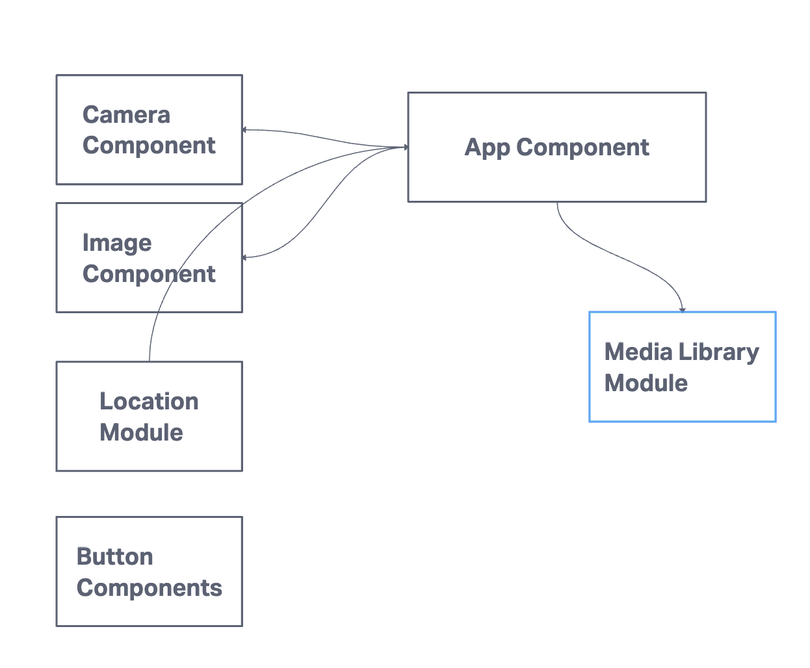

# React Native Expo Camera App

## Overview

This React Native app, built with Expo, features a user-friendly camera application that utilizes native device features. It enables users to take pictures using the front or back camera and save them to the camera roll. The app also handles location permissions, although this feature isn't actively used in the current implementation.

## Milestone 2: Polish and Delivery

### Enhanced User Experience

- **Quality Styling**: Utilizing CSS-in-JS, the app boasts a polished and responsive design that enhances user interaction.
- **Accessibility Focus**: Emphasizes right-sized tap targets and high-contrast elements for inclusive usability.
- **Dark and Light Modes**: Supports both modes, catering to user preferences and different lighting conditions.

### Core Features

- Live camera preview with front and back camera toggling.
- Capability to capture and save images to the camera roll.
- Location permission requests (currently not actively used).

## Setup

To run this app:

1. Clone the repository.
2. Install dependencies using `npm install`.
3. Start the app with `expo start`.

## Permissions

Requires permissions for camera access, media library access, and location access, requested on first launch.

## User Stories

- **As a user, I want to view a live camera feed so that I can see what the camera sees in real-time.**
- **As a user, I want to be able to toggle the camera view between front and back so that I can choose the camera perspective.**
- **As a user, I want to take a picture with a single tap so that I can capture images quickly and easily.**
- **As a user, I want the pictures I take to be saved to my camera roll so that I can access them later.**
- **As a user, I want to be asked for permission before the app accesses my camera and location so that I can control my privacy settings.**
- **As a user, I expect to be notified if there's an error, such as when permissions are not granted, so that I understand why the app isn't working as expected.**

## Code Snippet

Below is the main application code:

```jsx
import React, { useState, useEffect, useRef } from 'react';
import { StyleSheet, Text, View, Button, Image, Alert } from 'react-native';
import * as Location from 'expo-location';
import { Camera } from 'expo-camera';
import * as MediaLibrary from 'expo-media-library';

export default function App() {
  // ... (rest of the code remains unchanged)
}

const styles = StyleSheet.create({
  // ... (rest of the styles remains unchanged)
});
```

### QR Code


### UML


