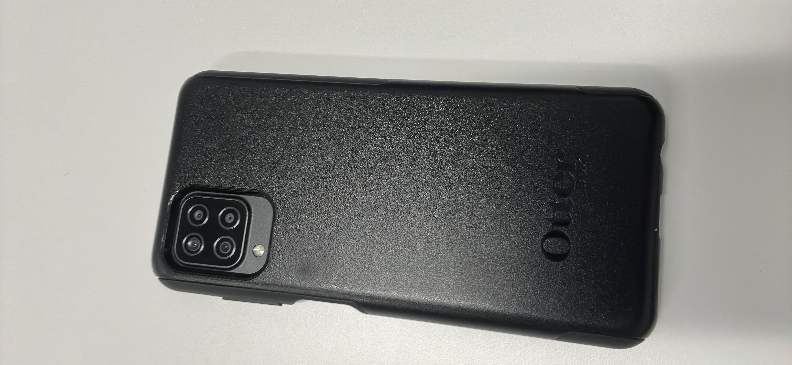
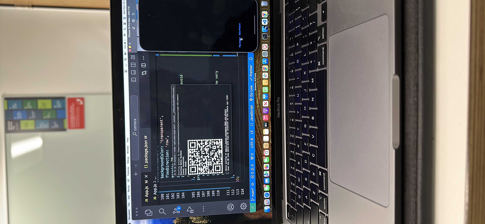

# React Native Expo Camera App

## Overview

This is a React Native app built with Expo that utilizes native device features. It allows the user to take pictures using the front or back camera and save them to the camera roll. The app also requests the user's location, although this feature is not actively used in the current implementation.

## Features

- Live camera preview
- Toggle between front and back cameras
- Capture and save images to the camera roll
- Request location permissions

## Setup

To run this app:

1. Clone the repository.
2. Install the dependencies using `npm install`.
3. Start the app with `expo start`.

## Permissions

The app requires permissions for camera access, media library access, and location access. These permissions are requested when the app is first launched.

## Code Snippet

Below is the main application code:

```jsx
import React, { useState, useEffect, useRef } from 'react';
import { StyleSheet, Text, View, Button, Image, Alert } from 'react-native';
import * as Location from 'expo-location';
import { Camera } from 'expo-camera';
import * as MediaLibrary from 'expo-media-library';

export default function App() {
  // ... (rest of the code remains unchanged)
}

const styles = StyleSheet.create({
  // ... (rest of the styles remains unchanged)
});
```

### Front Facing image



### Back-Facing Image



### Save Image


### UML


